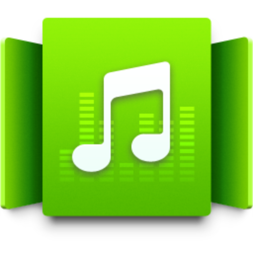

<p align="right">
  中文 | <a href="README.en.md">English</a>
</p>

<p align="center">
  
</p>

<h1 align="center">Electron AudioStation</h1>

<p align="center">
  一个轻量级的 Synology AudioStation 客户端，适用于 macOS 和 Windows。使用 Electron 构建。
</p>


## ✨ 特性

- 🎵 将 Synology AudioStation 网页包装成原生桌面应用
- 🎮 媒体控制快捷键：播放/暂停、下一曲、上一曲、停止
- 🔊 音量控制：增大音量、减小音量
- 🌐 多语言支持：中文和英文界面
- ⚙️ 简单配置：通过设置界面快速编辑所有选项
- 🖥️ 跨平台：支持 macOS 和 Windows

## 📦 安装

### 下载安装包

从 [GitHub Releases](https://github.com/sdjnmxd/electron-audiostation/releases) 下载适合您操作系统的安装包。

### 支持的平台

- **Windows**：便携版或安装包（nsis）
- **macOS**：`.dmg`
- **Linux**：`.rpm`

## 🚀 快速开始

1. 下载并安装应用
2. 运行应用
3. 首次启动时，输入您的 Synology AudioStation URL（例如：`https://your-nas-address/audio/`）
4. 享受您的音乐！

## ⌨️ 快捷键

| 快捷键 | 功能 |
|----------|----------|
| `媒体播放/暂停` | 播放或暂停当前歌曲 |
| `媒体下一曲` | 播放下一首歌曲 |
| `媒体上一曲` | 播放上一首歌曲 |
| `媒体停止` | 停止播放 |

**注意**：在 macOS 10.14 Mojave 及更高版本上，您可能需要将应用授权为[可信任的辅助功能客户端](https://developer.apple.com/library/archive/documentation/Accessibility/Conceptual/AccessibilityMacOSX/OSXAXTestingApps.html)以使用媒体控制快捷键。

## 🛠️ 开发

### 要求

- Node.js
- npm 或 yarn

### 设置开发环境

```bash
# 克隆仓库
git clone https://github.com/sdjnmxd/electron-audiostation.git
cd electron-audiostation

# 安装依赖
npm install
# 或
yarn

# 启动应用
npm start
# 或
yarn start
```

### 构建应用

```bash
# 构建 Windows 版本
npm run electron:windows
# 或
yarn electron:windows

# 构建 macOS 版本
npm run electron:mac
# 或
yarn electron:mac

# 构建 Linux 版本
npm run electron:linux
# 或
yarn electron:linux
```

## 📝 许可证

本项目采用 [GPL-3.0](LICENSE) 许可证。

**Electron AudioStation 是一个开源社区项目，而非 Synology 官方产品。Synology AudioStation Web 是 Synology DSM 中的一个组件。**

## 🤝 贡献

欢迎贡献、提出问题和功能请求！

## 📧 联系

作者：[milkfish](https://www.milkfish.site)